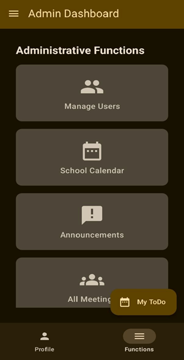

# Parent-Teacher Engagement App

A modern Android application designed to facilitate seamless communication and collaboration between parents and teachers. This app streamlines the educational process by providing a platform for direct messaging, meeting scheduling, event management, and more.

## Features

- **User Authentication**
  - Secure login and registration for parents and teachers
  - Role-based access control
  - Password recovery system
  - Multi-language support (English and Amharic)

- **Messaging System**
  - Real-time chat between parents and teachers
  - Message history
  - Notification system
  - Read receipts
  - File sharing capabilities

- **Meeting Management**
  - Schedule parent-teacher meetings
  - View and manage meeting requests
  - Meeting reminders and notifications
  - Meeting status tracking (Pending, Accepted, Rejected)
  - Meeting notes and follow-ups

- **Event Management**
  - School events calendar
  - Event details and RSVP functionality
  - Event notifications
  - Event categories and filtering
  - Event attendance tracking

- **Academic Progress Tracking**
  - View student marks and progress
  - Performance analytics
  - Progress reports
  - Grade history
  - Subject-wise performance breakdown

- **Todo List**
  - Task management for both parents and teachers
  - Priority-based organization
  - Due date tracking
  - Task categories
  - Task completion status

## Screenshots

Here are some screenshots of the app:

### Login Screen


### Admin Dashboard


### Admin Functions



### Teacher Dashboard


### Parent Dashboard


### Chat Screen


### Amharic Dashboard


## Technical Details

- **Built with:**
  - Kotlin
  - Jetpack Compose
  - Firebase (Authentication, Firestore, Cloud Messaging)
  - Material Design 3
  - Kotlin Coroutines for asynchronous operations
  - Dagger Hilt for dependency injection
  - Navigation Component for screen navigation

- **Architecture:**
  - MVVM (Model-View-ViewModel)
  - Clean Architecture principles
  - Repository pattern
  - Use Cases (Interactors)
  - Data Sources (Remote and Local)

## Getting Started

### Prerequisites

- Android Studio Arctic Fox or newer
- JDK 11 or newer
- Android SDK 21 or newer
- Google Firebase account
- Git

### Installation

1. Clone the repository:
   ```bash
   git clone https://github.com/ILBrother97/Parent-Teacher-Engagement-PTE-.git
   ```

2. Open the project in Android Studio

3. Add your Firebase configuration:
   - Create a new Firebase project
   - Add your `google-services.json` file to the app directory
   - Enable Authentication (Email/Password)
   - Set up Firestore Database
   - Configure Cloud Messaging

4. Configure the project:
   - Update the Firebase configuration in `app/google-services.json`
   - Set up your Firebase security rules
   - Configure notification channels

5. Build and run the project:
   ```bash
   ./gradlew build
   ```

## Project Structure

```
app/
├── src/
│   ├── main/
│   │   ├── java/
│   │   │   └── com/example/parent_teacher_engagement/
│   │   │       ├── components/      # Reusable UI components
│   │   │       ├── firebase/        # Firebase related code
│   │   │       ├── model/          # Data models
│   │   │       ├── navigation/     # Navigation components
│   │   │       ├── screens/        # UI screens
│   │   │       ├── service/        # Background services
│   │   │       └── utils/          # Utility classes
│   │   └── res/                    # Resources
│   └── test/                       # Unit tests
└── build.gradle.kts                # Build configuration
```

## Contributing

Contributions are welcome! Please feel free to submit a Pull Request. For major changes, please open an issue first to discuss what you would like to change.

### Development Workflow

1. Fork the repository
2. Create your feature branch (`git checkout -b feature/AmazingFeature`)
3. Commit your changes (`git commit -m 'Add some AmazingFeature'`)
4. Push to the branch (`git push origin feature/AmazingFeature`)
5. Open a Pull Request

## License

This project is licensed under the MIT License - see the LICENSE file for details.

## Contact

IlBrother - [@ILBrother97](https://github.com/ILBrother97)

Project Link: [https://github.com/ILBrother97/Parent-Teacher-Engagement-PTE-](https://github.com/ILBrother97/Parent-Teacher-Engagement-PTE-)

## Acknowledgments

- Material Design 3 for the UI components
- Firebase for backend services
- Jetpack Compose for modern UI development
- All contributors who have helped shape this project 